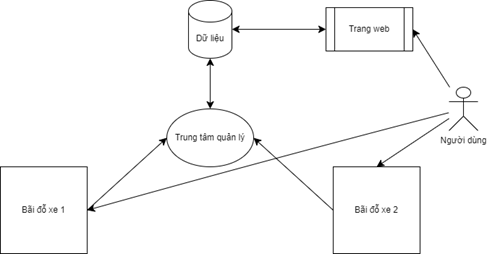
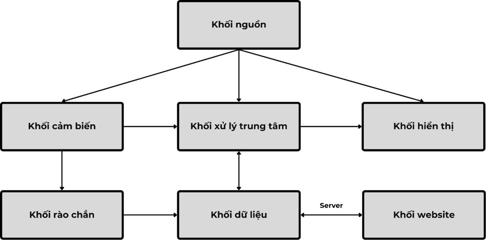
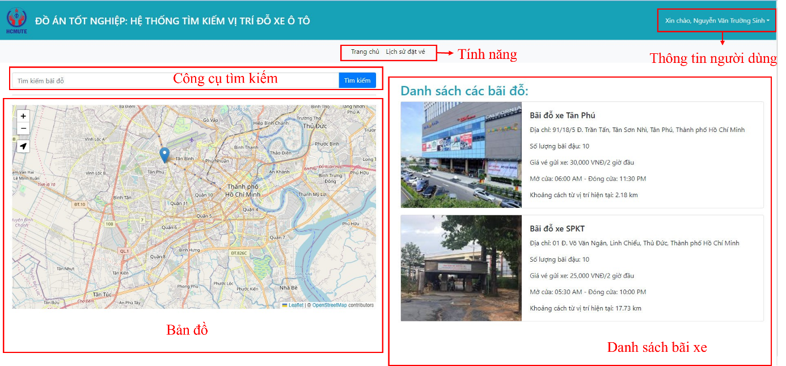
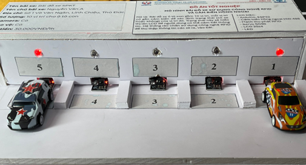

# Parking Lot System

## 1. Introduction  
In the context of the growing number of cars, finding a parking space becomes increasingly difficult and time-consuming. This project aims to design a **smart parking lot system** that helps users easily locate available parking spots.

The system uses:  
- **Arduino Mega 2560** microcontroller, programmed in C.  
- An LCD screen to display the real-time number of free parking spots.  
- Infrared (IR) sensors to detect cars entering and exiting.  
- Automatic barriers controlled by SG90 servo motors.  
- **RFID** technology to manage access to the parking lot.  
- A **Django** web application (Python) that allows users to check parking status and reserve spaces online.  
- Communication between the hardware (Arduino + ESP32) and the web app via UART.

## 2. Main Features  
- Real-time display of available parking spots on the LCD screen.  
- Detection of cars entering and leaving using IR sensors.  
- Automatic barrier control using SG90 servo motors.  
- Access control with RFID.  
- Web interface for checking parking status and booking online.  
- Role-based access: admin, parking lot owner, customer.  
- Integration between hardware (Arduino/ESP32) and the web application.

## 3. Technologies Used  
- Programming languages: **C**, **Python**  
- Web framework: Django  
- Microcontrollers: Arduino Mega 2560, ESP32  
- Display: 20×4 LCD  
- Sensors: Infrared (IR) sensors  
- Actuator: SG90 servo motor  
- Identification: RFID  
- Communication protocol: UART  

## 4. Demo Images  
### System Model  
  

### Web Interface  

### Hardware Setup  
  

## 5. Demo Video  
Watch a demonstration of the system in action on [YouTube](https://youtu.be/rE3_HVR2oAg).

## Detailed Documentation
You can download the full project documentation in PDF format at the following link:  
[Download the project documentation](https://drive.google.com/file/d/1lAmccCnmShYzYUMBf83VBdPLXpxvZLgz/view?usp=sharing).

## Contribution
For any contributions or feedback, please contact the author via GitHub or email.